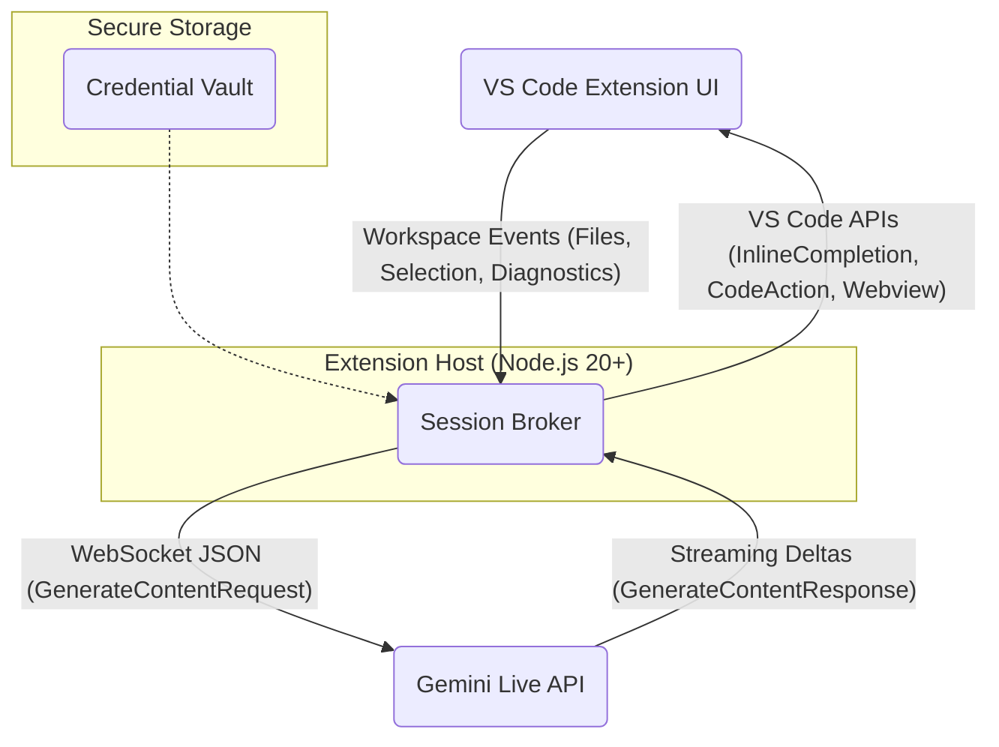

# Gemini Live Share VS Code Extension

[](https://opensource.org/licenses/MIT)

**Stream your live VS Code editor state directly to Google's Gemini Live API and receive real-time, multimodal AI assistance directly within your IDE.**

This extension provides a seamless bridge between your local development environment and the power of Gemini 2.5 Pro Live. It enables features like intelligent inline code completions, context-aware code actions (e.g., "fix this", "explain this"), and an integrated chat panel that understands your current file context without manual copy-pasting.

## Features

*   **Live Inline Completions:** Get real-time code suggestions ("ghost text") as you type, powered by Gemini's understanding of your current file and cursor position.
*   **Contextual Code Actions:** Trigger specific Gemini actions on selected code or diagnostics (e.g., automatically apply fixes, generate explanations).
*   **Integrated Chat Panel:** Interact with Gemini in a dedicated panel that shares the live state of your active editor, providing highly relevant assistance.
*   **Terminal Monitoring:** Monitor terminal output and get AI insights on commands and their results.
*   **Low Latency:** Leverages the Gemini Live API's bi-directional WebSocket for millisecond-level interaction.
*   **Privacy Conscious:** Designed with privacy in mind, allowing for filename hashing and PII stripping.

## Getting Started

### Prerequisites
1. Node.js (v20 or higher)
2. npm
3. VS Code
4. A Google Gemini API Key (obtainable from [Google AI Studio](https://aistudio.google.com/app/apikey))

### Installation Steps

1. **Clone the Repository:**
   ```bash
   git clone https://github.com/HarleyCoops/VSCodeLiveShare.git
   cd VSCodeLiveShare/vscodeliveshare
   ```

2. **Install Dependencies:**
   ```bash
   npm install
   ```

3. **Set Up API Key:**
   Create a `.env` file in the project root:
   ```
   GEMINI_API_KEY=YOUR_API_KEY_HERE
   ```
   *(Note: For production/distribution, use secure storage mechanisms like VS Code's `SecretStorage` instead of `.env`)*

4. **Launch the Extension in Development Mode:**
   ```bash
   code --extensionDevelopmentPath=/path/to/VSCodeLiveShare/vscodeliveshare
   ```
   Or simply open the `vscodeliveshare` folder in VS Code and press F5 to start debugging.

## Running the Extension

### Method 1: Manual Launch

1. Open the `vscodeliveshare` folder in VS Code
2. Press F5 to start debugging (this will open a new VS Code window with the extension loaded)
3. In the new window, open any code file (e.g., a `.js` or `.ts` file)
4. Open the Command Palette (Ctrl+Shift+P or Cmd+Shift+P)
5. Run the command: `Start Gemini Live Share`
6. You should see a notification that the session has started
7. Start typing or move your cursor to see inline completions appear

### Method 2: Using the Test Scripts

The repository includes test scripts to automate the testing process:

1. **Basic Test**
   ```bash
   cd vscodeliveshare
   npm run test:manual
   ```
   This will:
   - Open a new VS Code window
   - Automatically run the test commands
   - Start a Gemini session
   - You should see notifications in the VS Code UI

2. **Terminal Monitoring Test**
   ```bash
   cd vscodeliveshare
   npm run test:terminal
   ```
   This will:
   - Open a new VS Code window
   - Start a Gemini session
   - Create a test terminal
   - Start terminal monitoring
   - Run some test commands in the terminal
   - Gemini will analyze the terminal output

## What to Expect During Testing

### Basic Functionality Test
When you run the basic test or start the extension manually:

1. You should see a notification saying "Gemini Live Share session started"
2. As you type in a code file, you may see "ghost text" suggestions appear
3. If you select a block of code, you can right-click and see "Gemini: Fix this code" and "Gemini: Explain this code" options in the context menu

### Terminal Monitoring Test
When you run the terminal monitoring test:

1. A new terminal will open
2. Test commands will be executed automatically
3. Gemini will analyze the terminal output and may provide insights
4. You can stop terminal monitoring via the Command Palette with "Stop Gemini Terminal Monitoring"

## Troubleshooting

If you encounter issues:

1. **Check the API Key**: Ensure your API key in the `.env` file is valid. If it's expired or invalid, you'll need to get a new one from [Google AI Studio](https://aistudio.google.com/app/apikey).

2. **Check the Console Output**: When running in debug mode, check the Debug Console in VS Code for error messages.

3. **WebSocket Connection Issues**: If the extension fails to connect to Gemini, check your internet connection and verify the API key is valid.

4. **Extension Not Activating**: Make sure you're running the command "Start Gemini Live Share" from the Command Palette.

## Common Issues and Solutions

1. **No inline completions appearing**:
   - Make sure the Gemini session is started (check for the notification)
   - Try typing more code to give Gemini context
   - Check the Debug Console for any error messages

2. **Code actions not showing up**:
   - Make sure you've selected a block of code before right-clicking
   - Verify the Gemini session is active

3. **Terminal monitoring not working**:
   - Make sure you've started terminal monitoring via the Command Palette
   - Check if the terminal has enough output for Gemini to analyze

## Architecture Overview

The extension operates with a core "Session Broker" running within the VS Code extension host. This broker manages the WebSocket connection to the Gemini Live API for the current workspace, throttles editor events, and translates between VS Code API events and the Gemini API protocol.



| Component             | Responsibility                                                                                                | Key Technologies/APIs                                                                 |
| :-------------------- | :------------------------------------------------------------------------------------------------------------ | :------------------------------------------------------------------------------------ |
| **VS Code Extension UI** | Captures editor state (files, selections, diffs), triggers commands, renders Gemini output (inline, actions, chat). | `vscode` API, `InlineCompletionProvider`, `CodeActionProvider`, `WebviewPanel`        |
| **Session Broker**    | Manages WebSocket session per workspace, throttles/debounces events, formats API requests, parses responses. | Node.js, `ws` or `@google/genai`, Asynchronous processing                             |
| **Gemini Live API**   | Google's backend service providing multimodal generative AI capabilities over WebSocket.                        | `wss://generativelanguage.googleapis.com/.../BidiGenerateContent`                     |
| **Credential Vault**  | Securely stores API keys (`GEMINI_API_KEY`) or service account tokens, preventing exposure to client code.    | VS Code `SecretStorage` API / OS Keychain                                             |

## Key Concepts Explained

*   **Session Broker:** The central piece of logic that manages the persistent WebSocket connection to Gemini for a given workspace. It ensures that editor events are efficiently streamed and responses are correctly routed back to the UI.
*   **Live Streaming:** Utilizes WebSockets for bi-directional, low-latency communication, allowing Gemini to receive editor updates and send back token-by-token responses in near real-time.
*   **Context Snippets:** To manage latency and cost, only relevant portions of the code (typically around the cursor) are sent to Gemini, along with system prompts to guide the AI.
*   **Structured Responses:** For Code Actions (like "fix" or "explain"), the extension can request structured JSON output from Gemini, making it easier to parse and apply changes programmatically (e.g., using `workspace.applyEdit`).
*   **Session Lifecycle:** The Live API has timeouts (default 10 mins). The broker needs to manage session keep-alive (`extendRequest`) or re-establishment.

## Contributing

Contributions are welcome! Please feel free to submit a Pull Request.

## License

This project is licensed under the MIT License - see the [LICENSE](LICENSE) file for details.

