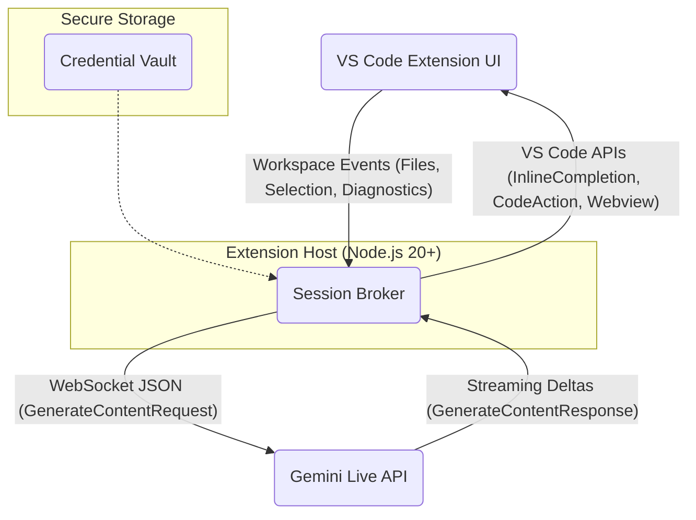

# Gemini Live Share VS Code Extension

[](https://opensource.org/licenses/MIT)

**Stream your live VS Code editor state directly to Google's Gemini Live API and receive real-time, multimodal AI assistance directly within your IDE.**

This extension provides a seamless bridge between your local development environment and the power of Gemini 2.5 Pro Live. It enables features like intelligent inline code completions, context-aware code actions (e.g., "fix this", "explain this"), and an integrated chat panel that understands your current file context without manual copy-pasting.

## Features

*   **Live Inline Completions:** Get real-time code suggestions ("ghost text") as you type, powered by Gemini's understanding of your current file and cursor position.
*   **Contextual Code Actions:** Trigger specific Gemini actions on selected code or diagnostics (e.g., automatically apply fixes, generate explanations).
*   **Integrated Chat Panel:** Interact with Gemini in a dedicated panel that shares the live state of your active editor, providing highly relevant assistance.
*   **Low Latency:** Leverages the Gemini Live API's bi-directional WebSocket for millisecond-level interaction.
*   **Privacy Conscious:** Designed with privacy in mind, allowing for filename hashing and PII stripping (implementation details in blueprint).

## Architecture Overview

The extension operates with a core "Session Broker" running within the VS Code extension host. This broker manages the WebSocket connection to the Gemini Live API for the current workspace, throttles editor events, and translates between VS Code API events and the Gemini API protocol.



| Component             | Responsibility                                                                                                | Key Technologies/APIs                                                                 |
| :-------------------- | :------------------------------------------------------------------------------------------------------------ | :------------------------------------------------------------------------------------ |
| **VS Code Extension UI** | Captures editor state (files, selections, diffs), triggers commands, renders Gemini output (inline, actions, chat). | `vscode` API, `InlineCompletionProvider`, `CodeActionProvider`, `WebviewPanel`        |
| **Session Broker**    | Manages WebSocket session per workspace, throttles/debounces events, formats API requests, parses responses. | Node.js, `ws` or `@google/genai`, Asynchronous processing                             |
| **Gemini Live API**   | Google's backend service providing multimodal generative AI capabilities over WebSocket.                        | `wss://generativelanguage.googleapis.com/.../BidiGenerateContent`                     |
| **Credential Vault**  | Securely stores API keys (`GEMINI_API_KEY`) or service account tokens, preventing exposure to client code.    | VS Code `SecretStorage` API / OS Keychain                                             |

## Technical Stack & Roadmap

This project leverages modern web technologies and the VS Code extension API.

**Phase 1: Core Implementation (Based on Blueprint)**

*   **Language:** TypeScript (compiled to JavaScript)
*   **Environment:** Node.js (v20+)
*   **VS Code API:**
    *   `vscode`: Core API access.
    *   `commands`: Registering user-invokable actions (e.g., `gemini.startSession`).
    *   `workspace`: Accessing documents, configuration, and events (`onDidChangeTextDocument`, `onDidChangeSelection`, `onDidSaveTextDocument`).
    *   `languages`: Registering providers (`registerInlineCompletionItemProvider`, `registerCodeActionsProvider`).
    *   `window`: Displaying messages, managing panels (`createWebviewPanel`).
    *   `SecretStorage`: Securely handling API keys.
    *   `TextEditor`, `TextDocument`, `Position`, `Range`, `Selection`: Representing editor state.
    *   `InlineCompletionItemProvider`, `CodeActionProvider`: Implementing core features.
    *   `Uri`: Handling file identifiers.
*   **Communication:**
    *   `ws` (Node WebSocket library): For direct WebSocket communication with the Gemini Live API.
    *   *(Alternative)* `@google/genai`: Official Google SDK abstracting WebSocket details.
*   **API:** Google Gemini Live API (`gemini-2.5-pro-live` model initially) via WebSocket (`wss://...`).
*   **Build & Setup:**
    *   `yo code`: VS Code extension scaffolding tool.
    *   `npm`: Package management and script execution (`compile`, `watch`).
    *   `dotenv`: Loading environment variables (`GEMINI_API_KEY`) for local development.
*   **Configuration:**
    *   `package.json`: Extension manifest (activation events, contributions, dependencies).
    *   `tsconfig.json`: TypeScript compiler options.

**Phase 2: Production Hardening & Enhancements**

*   **Authentication:** Implement OAuth 2.0 flow or Service Account key handling for Vertex AI integration (more robust for enterprise/shared environments).
*   **Telemetry:** Integrate basic logging (e.g., request/response token counts, latency) for monitoring usage, cost, and performance. Consider VS Code's telemetry reporting mechanisms or a dedicated logging service.
*   **Error Handling & Fallback:**
    *   Implement robust error handling for WebSocket connection issues, API errors (e.g., 429 rate limits with exponential backoff).
    *   Develop a fallback mechanism to use the standard Gemini REST API if the Live API is unavailable or experiences persistent issues.
*   **Advanced Context Management:**
    *   Refine the `codeSnippet` logic for optimal context window usage and latency.
    *   Implement more sophisticated diffing algorithms if needed beyond simple line slicing.
    *   Explore techniques for summarizing or embedding larger files/projects if context limits become an issue.
*   **UI/UX Refinements:**
    *   Improve the chat panel interface.
    *   Add status indicators for the Gemini connection.
    *   Provide more granular user settings (e.g., model selection, debounce timers, completion triggers).
*   **Security Review:** Conduct a thorough review to ensure no sensitive information (paths, keys, PII) is inadvertently leaked. Formalize privacy measures like filename hashing and comment stripping.
*   **Testing:** Develop unit tests for the Session Broker logic and integration tests using the VS Code testing APIs.

## Getting Started

1.  **Prerequisites:**
    *   Node.js (v20 or higher)
    *   npm
    *   VS Code
    *   A Google Gemini API Key (obtainable from [Google AI Studio](https://aistudio.google.com/app/apikey))

2.  **Clone the Repository (Once Created):**
    ```bash
    git clone <repository-url>
    cd gemini-live-share
    ```

3.  **Install Dependencies:**
    ```bash
    npm install
    ```

4.  **Set Up API Key:**
    Create a `.env` file in the project root:
    ```
    GEMINI_API_KEY=YOUR_API_KEY_HERE
    ```
    *(Note: For production/distribution, use secure storage mechanisms like VS Code's `SecretStorage` instead of `.env`)*

5.  **Compile the Extension:**
    ```bash
    npm run compile
    ```
    *(Or `npm run watch` for automatic recompilation on changes)*

6.  **Run in Development Mode:**
    *   Open the project folder in VS Code.
    *   Press `F5` (or navigate to `Run > Start Debugging`). This will open a new VS Code window ([Extension Development Host]).
    *   In the new window, open any code file (e.g., a `.js` or `.ts` file).
    *   Open the Command Palette (`Cmd/Ctrl+Shift+P`).
    *   Run the command: `Start Gemini Live Share`.
    *   Start typing or move your cursor to see inline completions appear.

## Key Concepts Explained

*   **Session Broker:** The central piece of logic that manages the persistent WebSocket connection to Gemini for a given workspace. It ensures that editor events are efficiently streamed and responses are correctly routed back to the UI.
*   **Live Streaming:** Utilizes WebSockets for bi-directional, low-latency communication, allowing Gemini to receive editor updates and send back token-by-token responses in near real-time.
*   **Context Snippets:** To manage latency and cost, only relevant portions of the code (typically around the cursor) are sent to Gemini, along with system prompts to guide the AI.
*   **Structured Responses:** For Code Actions (like "fix" or "explain"), the extension can request structured JSON output from Gemini, making it easier to parse and apply changes programmatically (e.g., using `workspace.applyEdit`).
*   **Session Lifecycle:** The Live API has timeouts (default 10 mins). The broker needs to manage session keep-alive (`extendRequest`) or re-establishment.

## Contributing

Contributions are welcome! Please refer to `CONTRIBUTING.md` (to be created) for guidelines on reporting issues, proposing features, and submitting pull requests.

## License

This project is licensed under the MIT License - see the [LICENSE](LICENSE) file (to be created) for details.
